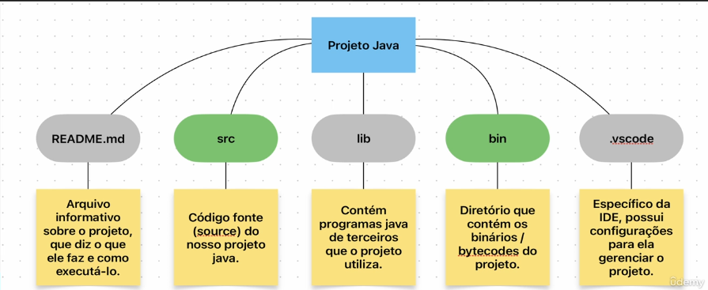
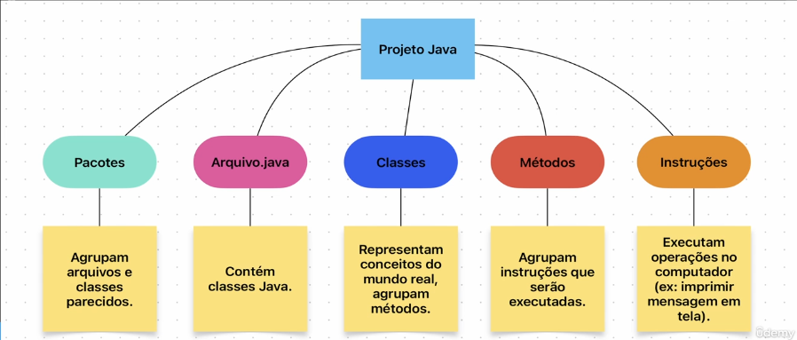
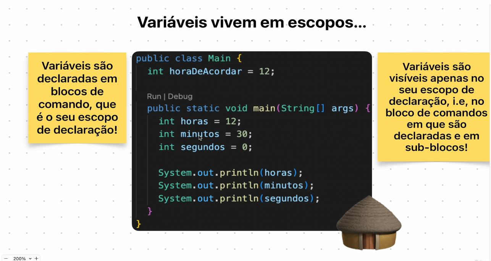
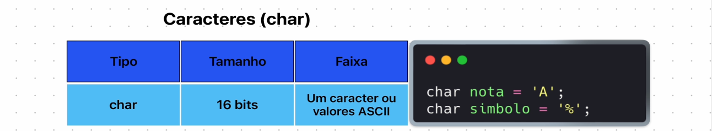
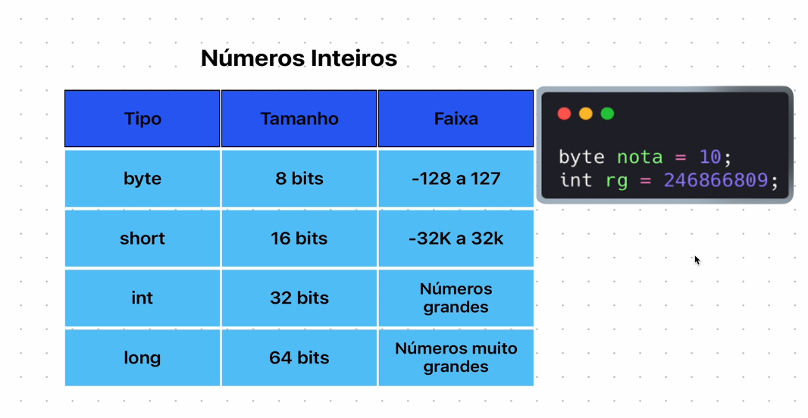
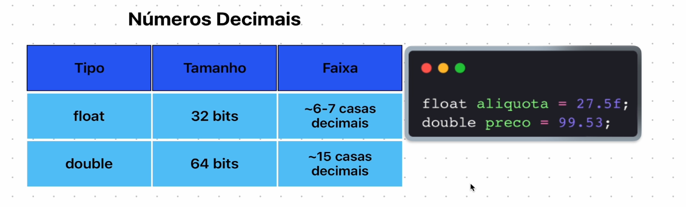
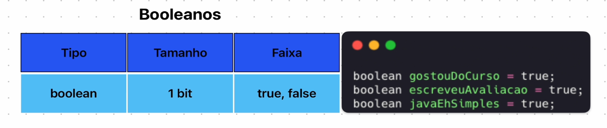
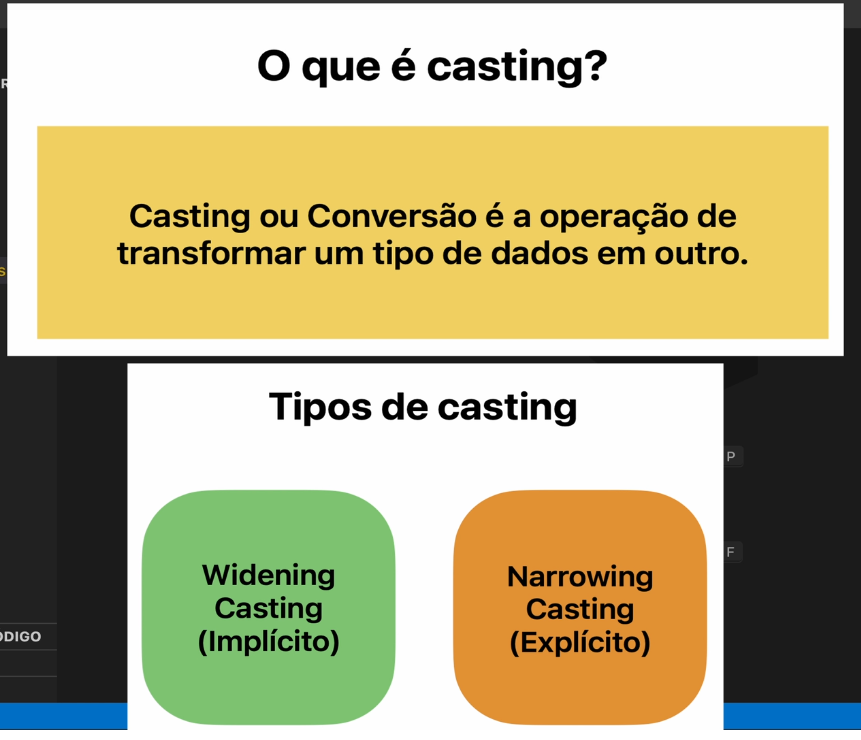

# Java
Aprendendo JAVA do inicio ao intermediario

# Variáveis e sua função
* O que são variáveis
    Variáveis armazenam informações que um programa precisa para funcionar.

# Variáveis = Container de Dados
* Tipo 
    Utilizados representar números, textos, decimais, caracteres.
* Identificador
    Segue convenção de nomes: primeira letra minúscula, camel case.
    Ex: horaDeAcordar, minutos, segundos

# Que identificadores são válidos / Inválidos ?
# Validos
* Palavras comuns
* Letras + Dígitos
# Invalidos
* Palavras reservadas do Java
* Caracteres Especiais

# Como usar variáveis ?
* Declaração
    int horas;
    int minutos;
    int segundos;

* Inicialização
    int horas = 12;
    int minutos = 0;
    int segundos = 23;

* Atribuição
    horas = 13;
    minutos = 10;
    segundos = 50;

* Uso
    System.out.println(horas);
    System.out.println(minutos);
    System.out.println(segundos);

# Variaveis possuem tipos
* Primitivo
    Pré-definidos, simples de criar, inicializar e manter. Variavel armazena diretamente o seu valor (tamanho fixo).
* Referência
    Criados a partir de classes. É armazenadas uma referência para o seu valor (tamanho variável)

# Tipos Primitivos
* Characters
  a, C, 2, %

* Integers
  1, 3, 452

* Decimals
  1.3, 2.0

* Booleans
  true, false

  
  
  
  

# Operadores
* Operadores desempenham operações

# Tipos de Operadores
* Aritiméticos
* Relacionais
* Atribuição
* Lógicos

# Casting
